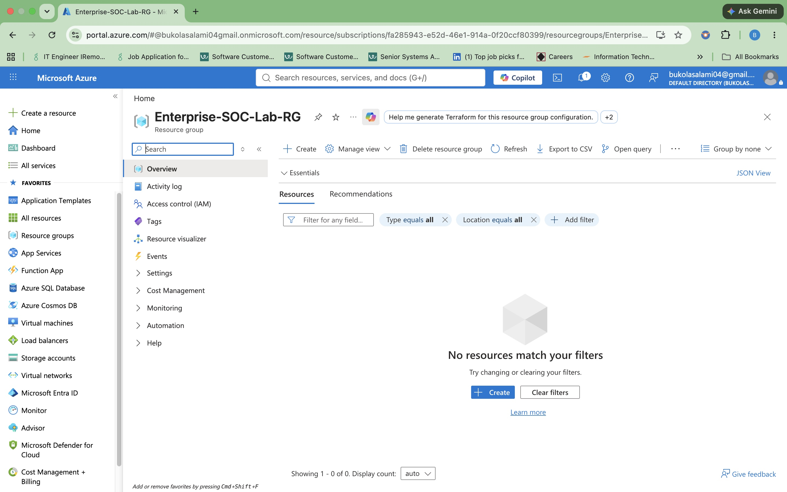
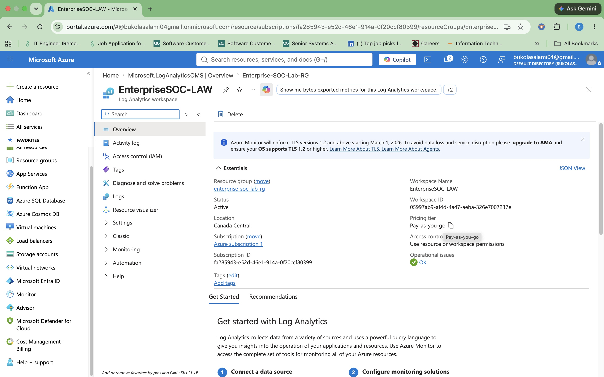
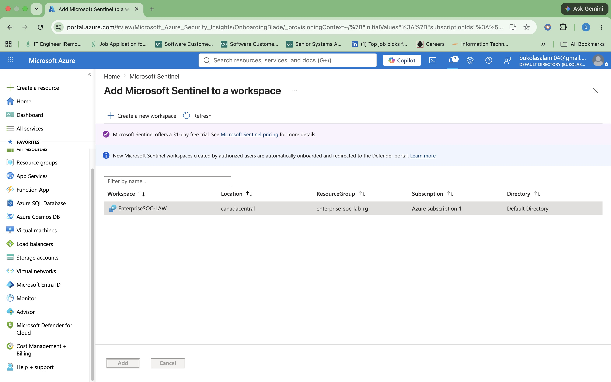

# Documentation

This folder contains documentation for each phase of the Enterprise Security Operations Lab.
# Phase 1: Azure Foundation and SIEM Deployment

The first phase of this project focused on building the Azure infrastructure required to support Microsoft Sentinel and Microsoft Defender XDR. This foundation provides the resources needed to collect, store, and analyze security telemetry before onboarding endpoints.

---

## ✅ Azure Resource Group

### Why I Implemented It

An Azure Resource Group was created to organize and manage all resources used throughout the project. Keeping related resources together simplifies deployment, monitoring, access management, and cleanup while providing a structured environment for the lab.

### Key Tasks Completed

- Created the **Enterprise-SOC-Lab-RG** Resource Group
- Selected **Canada Central** as the deployment region
- Verified successful deployment in the Azure portal

### What I Learned

I learned that a Resource Group acts as a logical container for Azure resources, making it easier to manage, monitor, and maintain cloud infrastructure throughout the project lifecycle.

---

## ✅ Log Analytics Workspace

### Why I Implemented It

A Log Analytics Workspace was created to serve as the central repository for security logs generated by connected resources. Microsoft Sentinel relies on this workspace to store and query data for threat detection, investigation, and threat hunting.

### Key Tasks Completed

- Created the **EnterpriseSOC-LAW** Log Analytics Workspace
- Selected **Canada Central** as the deployment region
- Connected Microsoft Sentinel to the workspace
- Verified the workspace was successfully created

### What I Learned

I learned that Microsoft Sentinel cannot analyze security events without a Log Analytics Workspace because it depends on stored log data to detect threats and investigate incidents.

---

## ✅ Microsoft Sentinel

### Why I Implemented It

Microsoft Sentinel was enabled to provide enterprise SIEM and SOAR capabilities for the lab. Sentinel analyzes security telemetry collected in the Log Analytics Workspace, enabling threat detection, incident investigation, threat hunting with KQL, and automated response.

### Key Tasks Completed

- Enabled Microsoft Sentinel
- Connected Sentinel to the Log Analytics Workspace
- Verified successful deployment
- Confirmed the workspace was ready to receive security telemetry

### What I Learned

I learned that Microsoft Sentinel is not a data repository. Instead, it analyzes security data stored in the Log Analytics Workspace to detect threats, create incidents, and support security investigations.

---

## Key Takeaways

- Built the Azure foundation required for a Microsoft security operations environment.
- Created and organized Azure resources using a Resource Group.
- Configured a Log Analytics Workspace to collect and store security telemetry.
- Enabled Microsoft Sentinel to provide SIEM and SOAR capabilities.
- Prepared the environment for onboarding Windows endpoints and performing threat detection in the next phase.
